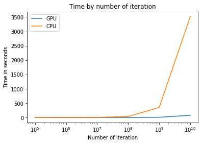

# Flame Fractal in Cuda

wrote by billio\_r and legoua\_g (2017)
## Abstract

Fractals are really interesting objects that can make beautiful image.
One class of these [IFS](https://en.wikipedia.org/wiki/Iterated_function_system)
(Iterated function system) are [fractal flame](https://en.wikipedia.org/wiki/Fractal_flame)
by Scott Draves in 1992.

Our work is a fractal generator using **CUDA** GPU programming to improve
computation time of these iterative objects. Our results are far from
mature software as [Electric Sheep](https://gold.electricsheep.org/) or
[Apophysis](http://www.apophysis.org/) which got much features than us
so its hard to compare. But we will discuss of our results comparing
our CPU and GPU implementation.

## Introduction

For the course of GPU computing we decide to make Flame fractal generator
as [Flam3](http://flam3.com). Even if there is already a **LOT** of
people who already do it, we found the idea funny and interesting.

To do so we base our work on the [paper](http://www.flam3.com/flame_draves.pdf)
written by Draves and Reckase, available on the [Flame3](http://flam3.com)
site. This paper give basic headline to compute fractal flames.

## Definition

Fractal flames differ from ordinary iterated function systems in three
ways:

1. Nonlinear functions are iterated in addition to affine transforms.
2. Log-density display instead of linear or binary.
3. Color by structure (with recursive path) instead of monochrome or
by density.

A fractal flame is define by a set of flame functions `Fj`.


Each flame function `Fj` is a sum of weighted variations (a list
of the 48 variations can found in the appendix of [flam3 paper](http://www.flam3.com/flame_draves.pdf)
.) These variations are non-linear (_point 1_) and use with an affine
transform.


Moreover, the flame functions contain a color and a probability.

At each iteration, a random flame is chosen from there probability.
This flame function is apply on the current position and return a new
position.

Moreover, the color of the pixel at the new position is update (like
this, we can see how flame function contribute to a pixel: _point 2_)
and it's density is increase by one.

The number of iteration is define in advance. It should be a number big
enough in order that the entropy applied. That main loop is call the
_chaos loop_.

Once the loop ended, some operations are needed to get a better
rendering. One popular method is to use an [oversampling](https://en.wikipedia.org/wiki/Oversampling)
or a [supersampling](https://en.wikipedia.org/wiki/Supersampling).
to reduce the noise and improve the entropy.

Once its done, the log-density (_point 3_) is used to improve the color
and a lot of other improvement can be done.

## The sad truth

We choose fractal because it was a well defined type of fractals, with a
simple mathematics definition. And as it was easy to found image of
such fractal we expected to easily found fractal flame formula. But it
was a mistake.

All the fractal flame generator try to be as user friendly as possible,
and implement different features which change their fractal definition.
Therefore, each generator have a different implementation and the few
formula found were to far from the basic mathematics definition to be
used.

Even the paper of S.Draves give formula of fractal flame in the
_Appendix B_ but that appendix does not exist ! It only give the formula
of the variations. We found an older version of the same paper with
**ONE** formula.

This was a big deception. We only found one good formula ! So we used
our own fractal flame or variations of basic fractal (such as the
Sierpinski triangle) but the one generate were as beautiful as expected.

**TODO: add images here**

## CPU implementation

For the CPU implementation we used C++ with pretty simple modelling.

### Variations

Here we used `std::function`. A variation is defined as:

```
Point variation(double x, double y);
```

### Flame functions

Flame functions are based on a simple class as:

```
FlameFunction:
  std::vector<Variation> variations
  std::vector<double> coefficents
  std::vector<double> weights
  Color color
```

### Fractal flames

Same here a fractal flames are simple:

```
FractalFlame:
  std::vector<FlameFunction> flamefunctions
  std::vector<Color> images
```

### Color

Fractal flames have a particularity in the color. As each flame function
has a particular color, we can use it to show which flame function
contribute the most to a pixel and therefore see the structure generate
by a particular variation.

Various implementation and improvement exist to compute the color. By
definition the color compute at each iteration should be:

```
newColor = (previousColor + flameFunctionColor) / 2
```

With this computation, a flame function which go a lot on that pixel
contribute more than the over and the last flame functions contribute
more than the first one.

However, we found that the last color contribute too much than it
should. After various tests, we found that an average have better
and nicer result.

Once the main loop terminated, we use log-density to smooth color.

```
newColor = previousColor * (1 - (log(density) / density))
```

Our color transformation stop here. If you read the state of the art,
there is much more transformations: gamma, filtering, blurs ... But as
we were late on deadline we choose to skip theses improvements.

Moreover, most of the implementation use set of color palette. But we
didn't want to take time to make a parser, found good one, and etc...

### Profiling

While checking the performance, we profile our code with `gprof`.

With a simple fractal flame, of 3 flame function containing 1 variation
each we pass 30% of our time to update the pixel's colors.

As it is the major action of our 'chaos loop' it seems quite
normal. For recall, the chaos loop is the main loop that call random
flame functions and apply the color.

## GPU implementation

### Where to improve

We tried different way to improve our computation time.

Our first thought was to improve the computation of the flame functions
by calling each variations in a different thread. But in practice its
seems that few flame functions have more than 2 or 3 variations so the
cost of a kernel will not be profitable. Moreover, while profiling the
CPU implementation, as variation function are really simple function
load the data to the GPU is over cost the time gain.

However we try it with random fractal flame using multiple variation but
our first implementation was not satisfying enough as expected so we
didn't continue that way.

Then we try an other optimization, on our chaos loop. It is our major
bottleneck. The main problem here is that the loop need the value of
the previous iteration. But these loop is base on the entropy, probability
and the law of large number. Therefore we still can make it parallel
using a loop per thread and reduce the number of iteration.

The result will not be exactly the same bits to bits but it is a good
thing to use because it increase the entropy and the quality of the
image.

The second problem is that all the threads will need to write on the pixel
array. At first we wanted to keep an image per thread but, as block can
have lot of thread, keep 1024 images of 1920x1080 pixels is insane and
it will be out of the GPU memory anyway. So another way is to keep only
one images (or one per block) and to use `atomicAdd()` (even if it's not
a good practice). And here we got our main speed improvement.

One last though was to improve memory access with shared memory or by
handling coalescing access. But the main problem is that as our flame
function are not linear, we never know were we will be our next write.
Moreover, as there is random in the main loop, we have no idea of where
the other thread are going to hit in the memory. So we didn't found a
nice solution to handle these access.

### Oversampling

One way to improve the rendering, as explain the the definition, is to
make [oversampling](https://en.wikipedia.org/wiki/Oversampling) or
[supersampling](https://en.wikipedia.org/wiki/Supersampling).

Here, with our implementation, changing the image resolution will not make
our fractal larger. It will just increase the showing windows. So
super-sampling is not useful here. That why we decide to use
oversampling, and also because GPU programming suit well for this.

As we have a lot of GPU threads, it is easy to run a lot of chaos loops.
And doing so, we can improve the computation time and the quality
of the generate fractal flame as we can easily compute more iterations
and therefore more sample.

### From CPU to GPU

#### Functor

First problem we got was the use of functors. The `std::function` as
they are function pointer does not suit well to GPU. The need to be on
`__device__` but we need there symbols to call the kernel with it.
But as they are not at the same address space we can't just make a
`cudaMemcpy()`.

There is something to solve the problem, `cudaMemcpyFromSymbol()`. But
the syntax is quite heavy as we need to pass multiple arrays of functors.
So we choose another way to do it easily.

The trick is quite simple. Variations are only define on `__device__`
and an array of functors is define with all our variations. Then when
the kernel is called, it only need arrays of index to get the
variations.

#### Object-oriented programming

As our first implementation was in C++, our CUDA implementation was
started in object-oriented C++. But at the end we completely change it.

We got various trouble with our implementation to move it to CUDA. Each
time the `cudaMemcpy()` have a real cost. And as our objects does not
have a lot of attributes and changing between C and C++
syntax was painful, at one point we found easier to completely pass to
C syntax with raw arrays and raw structures.

This come with an insane code reduction and we ended with a single
kernel and a single file of 200 lines.

### Profiling

As we end with only one kernel, profiling does give us any information.

## Comparison

Our benchmark are done on:

- GTX 1050 with 5 blocks of 1024 threads
- On 3.5 GHz Intel Core i7-7567U

The results are direct:

Number of iteration | GPU time| CPU time
--------------------|---------|---------
1e5                 | 0.140s  | 0.35s
1e6                 | 0.290s  | 0.82s
1e7                 | 0.531s  | 4.05s
1e8                 | 1.292s  | 35.22s
1e9                 | 8.301s  | 350s
1e10                | 76.908s | 3157s

We can see that the CPU time is nearly linear with the number of
iteration and that absolutely not the case of the GPU.



Here the y axis is scaled to log.

## Reference

1. [The Fractal Flame Algorithm](http://www.flam3.com/flame_draves.pdf)
by S.Draves and E.Reckase, 2003.

2. [Fractal flame](https://en.wikipedia.org/wiki/Fractal_flame) on
Wikipedia.

3. [Iterated function system](https://en.wikipedia.org/wiki/Iterated_function_system)
on Wikipedia.

## Appendix A: Variation of Sierpinski triangle


## Appendix B: Misc


